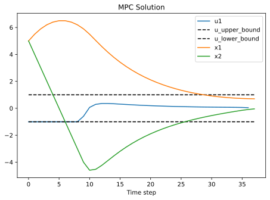
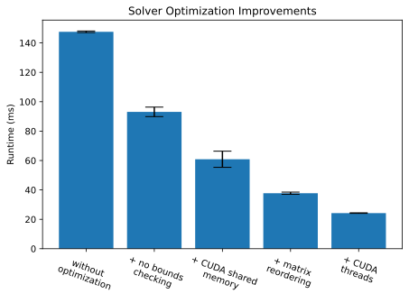
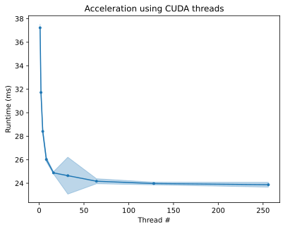
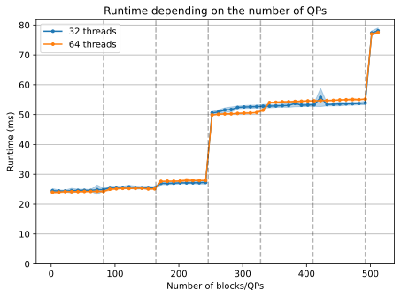
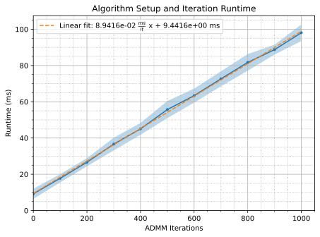

# Non-allocating Heterogenous Batch Quadratic Program Solver in CUDA vs on the CPU

<p align="center">

</p>

---

## Introduction

I implement a projection-based quadratic program solver (QP) in CUDA and on the
CPU.  The solver is based on the Alternating Direction Method of Multipliers
(ADMM) algorithm and is implemented in Julia and is non-allocating (does not
allocate memory dynamically, which helps it run on the GPU without
modifications). The purpose of this project is (1) to show how simplest QP
program solver can be implemented (whose runtime is competitive with existing QP
solvers) and (2) to learn about CUDA program optimizations when applied to a
real problem. The solver is implemented in Julia because the language is higher
level than C++ and faster to write, while its runtime is comparable to C++
(often within 0.5x-1.5x). However, the implementation is very low-level to work
with both in CUDA and on the CPU. 

The solver is a heterogeneous batch solver, meaning there it can solve a batch
of QPs even if every single one of the problems has a different data, dimension
and sparsity structure. Thus, I intentionally implement the solver
start-to-finish within a single routine without making use of batching
individual steps (e.g., matrix factorization, linear system solve, etc.). I use
this contrived generality to differentiate myself from other implementations and
make the CUDA code optimization more difficult.

I test the solver on a Model Predictive Control (MPC) problem, an optimal
control problem of finding the best (trading off tracking and energy
expenditure) controls to a simple dynamical system to steer it towards a
specified goal. I compare the CPU performance and CUDA performance. I find that
an NVIDIA RTX 3090 can solve about 2.5 as many problems as a single core of
Ryzen 7 5800X processor. This is a rather disappointing result, either because
(i) heterogenous QP solvers are not a good for the CUDA architecture (because of
the sequential nature of the linear system solve operation on which the solver
relies repeatedly) or (ii) because my CUDA program optimizations could be
improved.

<p align="center">

</p>

---

## Quadratic Programming (QP) via Alternating Direction Method of Multipliers (ADMM)

A general quadratic program (QP) is defined as:
$$ \text{minimize} ~~ \frac{1}{2} z^T P z + q^T z \\
\text{subject to} ~~ C z \leq b \\
$$
where $P$ is a symmetric positive definite matrix.

Because of the type of a QP solver I implement here, I further require that (1)
the constraints are both upper and lower bounded (which is a generalization,
since one can choose positive or negative infinity for the respective bound) and
that (2) the matrices $P$, $A$ are sparse (otherwise a dense solver is a more
efficient software solution).
$$ \text{minimize} ~~ \frac{1}{2} z^T P z + q^T z \\
\text{subject to} ~~ l \leq C z \leq u \\
$$

### The Model Predictive Control (MPC) Test Problem

The test problem I consider in this work is the Model Predictive Control (MPC) on a dynamical system with linear dynamics.
$$ x^{(k+1)} = A x^{(k)} + B u^{(k)} $$
where $x$ is the vector state $u$ is the vector control and $A$ and $B$ are
arbitrary dense dynamical matrices.

### Alternating Direction Method of Multipliers (ADMM) Algorithm for Quadratic Programs

There are currently two popular way to solve quadratic optimization programs (with inequalities):
- the [interior-point
method](https://en.wikipedia.org/wiki/Interior-point_method) where the
inequalities are converted into smooth barriers and are iteratively refined
- the projection-based method, where altenatingly solve the problem (i) without
accounting for inqualities and (ii) projecting the optimization variables onto a
set where inequalities are satisfied
    - this method includes a way to bias the process to converge

The second method is often easier to implement and recently has been enjoying
success with an extremely high-quality implementation in the form of the
[OSQP](https://osqp.org/) solver. In fact, the implementation here is very
heavily insipired by the OSQP implementation (and, in the case of the CPU
version, it reaches the same competitive computational time as OSQP).

The method used by OSQP is a type of projection-based optimization method called
Alternating Direction Method of Multipliers (ADMM). An excellent reference is
available in these [lecture
slides](https://web.stanford.edu/~boyd/papers/pdf/admm_slides.pdf) and in the
[OSQP paper](https://ieeexplore.ieee.org/abstract/document/8263928/).

**The general ADMM algorithm (page 17 of lecture slides):**

For a split, optimization + projection problem, the ADMM algorithm is:
$$ 
\text{minimize} ~~ f(z) + g(w) \\
\text{subject to} ~~ C z = w ~~~~~~~
$$

$$
\begin{aligned}
z^{(k+1)} &= \text{argmin} f(z) + \frac{\rho}{2} \| C z - w^{(k)} + \rho^{-1} y^{(k)} \|_2^2 \\
w^{(k+1)} &= \text{argmin} g(w) + \frac{\rho}{2} \| C z^{(k+1)} - w + \rho^{-1} y^{(k)} \|_2^2 \\
y^{(k+1)} &= y^{(k)} + \rho \left( C z^{(k+1)} - w^{(k+1)} \right)
\end{aligned}
$$

**Our case:**

In our case:
$$f(z) = \frac{1}{2} z^T P z + q^T z \\
g(w) = \begin{cases} 0 ~~~ \text{if} ~ l \leq w \leq u \\ \infty ~~ \text{otherwise} \end{cases} $$

Finding the *argmin* of $g(w)$ is equivalent to projecting $w$ onto the set
where the inequalities are satisfied (because $w$ is scaled by identity in $\frac{\rho}{2} \| C z - w + y \|_2^2$). This is extremely simple (which is why
ADMM is so well suited here).

The updates then take the form
$$ 
\begin{aligned}
z^{(k+1)} &= \text{argmin} \frac{1}{2} z^T P z + q^T z + \frac{\rho}{2} \| C z - w^{(k)} + \rho^{-1} y^{(k)} \|_2^2 & = \left( P + \rho C^T C\right)^{-1} \left( C^T (w - y) - q\right) \\
 w^{(k+1)} &= \text{argmin}_{l \leq w \leq u} \frac{\rho}{2} \| C z^{(k+1)} - w + \rho^{-1} y^{(k)} \|_2^2 &= \text{min}(u, ~ \text{max}(l, ~ C z^{(k+1)} + \rho^{-1} y^{(k)})) \\
 y^{(k+1)} & &= y^{(k)} + \rho (C z^{(k+1)} - w^{(k+1)}) 
\end{aligned}
$$

However, this formulation is *numerically* problematic because
- it requires an inverse of $P + \rho C^T C$ 
  - which, despite significant sparsity in $P$ and $C$ can end up having large fillin (many nonzero elements) and thus be expensive to factorize and solve
- it requires computing $C z^{(k+1)}$ and $C^T (w - y)$ 
  - at every iteration of which there can many

Instead, OSQP suggests using the split version of the problem, by introducing extra variables, which can eliminate both of these problematic operations.

**Split version of the problem**

$$ 
\begin{aligned}
\text{minimize} & ~~ \frac{1}{2} z^T P z + q^T z \\
\text{subject to} & ~~ C z - v = 0 \\
& ~~ v = w \\
& ~~ l \leq w \leq u
\end{aligned} 
$$
where we introduce the extra variable $v$. ADMM requires us to split the problem into two stages, which we do so:
- $f(z, v) = \frac{1}{2} z^T P z + q^T z ~~ \text{subject to} ~~ C z = v$
- $g(w) = \begin{cases} 0 ~~~ \text{if} ~ l \leq w \leq u \\ \infty ~~ \text{otherwise} \end{cases}$

where the ADMM consensus constraint is now $v = w$ (instead of $C z = w$).

The updates become
$$ 
\begin{aligned}
z^{(k+1)}, v^{(k+1)} &= \text{argmin}_{C z = v} ~~ \frac{1}{2} z^T P z + q^T z + \frac{\rho}{2} \| v - w^{(k+1)} + \rho^{-1} y^{(k)} \|_2^2 & \\
w^{(k+1)} &= \text{argmin}_{l \leq w \leq u} ~~ \frac{\rho}{2} \| v^{(k+1)} - w + \rho^{-1} y^{(k)} \|_2^2 &= \text{min}(u, ~ \text{max}(l, ~ v^{(k+1)} + \rho^{-1} y^{(k)})) \\
y^{(k+1)} & &= y^{(k)} + \rho (v^{(k+1)} - w^{(k+1)})
\end{aligned}
$$
where the first of minimization problem is not trivial as it involves two vector variables $z$ and $v$ and a constraint $C z = v$. However, it can be solved by introducing a Lagrange multiplier $\lambda$
$$ \min_{z, v} L(z, v, \lambda) = \min_{z, v} \frac{1}{2} z^T P z + q^T z + \frac{\rho}{2} \| v - w^{(k+1)} + \rho^{-1} y^{(k)} \|_2^2 + \lambda^T \left( C z - v \right) $$
this produces a set of linear equation to solve it (by differentiating the Lagrangian with respect to $z$ and then $v$, and then adding another equation for constraint satisfaction).
$$
\begin{cases}
P z + q + C^T \lambda = 0 \\
-\lambda + \rho (v - w^{(k)} - \rho^{-1} y^{(k)}) = 0 \\
C z - v = 0
\end{cases}
$$
the trick to solving these equations efficiently is to eliminate $v$ algebraically by solving the second equation for $v = w^{(k)} - \rho^{-1} y^{(k)} + \rho^{-1} \lambda$ and substituting it into the third equation to get two equation to solve
$$
\begin{cases}
P z + C^T \lambda = -q \\
C z - \rho^{-1} \lambda = w^{(k)} - \rho^{-1} y^{(k)}
\end{cases}
$$
which is the linear system in the matrix form
> $$
\begin{bmatrix}
P & C^T \\
C & -\rho^{-1} I
\end{bmatrix}
\begin{bmatrix}
z^{(k+1)} \\
\lambda^{(k+1)}
\end{bmatrix}
= \begin{bmatrix}
-q \\
w^{(k)} - \rho^{-1} y^{(k)}
\end{bmatrix} ~~ \text{then} ~~ v^{(k+1)} = w^{(k)} - \rho^{-1} y^{(k)} + \rho^{-1} \lambda^{(k+1)}
$$

finally, the remaining updates are easy
> $$
\begin{aligned}
w^{(k+1)} &= \text{argmin}_{l \leq w \leq u} ~~ \frac{\rho}{2} \| v^{(k+1)} - w + \rho^{-1} y^{(k)} \|_2^2 &= \text{min}(u, ~ \text{max}(l, ~ v^{(k+1)} + \rho^{-1} y^{(k)})) \\
y^{(k+1)} & &= y^{(k)} + \rho (v^{(k+1)} - w^{(k+1)})
\end{aligned}
$$

*Note we have not quite reached the linear system form from OSQP, we are missing
$\sigma$ regualization of $z$. In the paper, the authors introduce yet another
ADMM variable, but its effect is equivalent to adding a $\sigma$ damping to the
$z$ updates in the ADMM. They likely do so, to guarantee that $P + \sigma I$ is
positive definite (and thus invertible). This detail is important, but would
have added unncessary complication to the explanation here.*

### Approximate Minimum Degree (AMD) Reordering

### The full QP ADMM Algorithm

- construct the 4x4 linear system matrix $A$
- find a reordering of $A$ that produces a sparser factorization matrix
- factorize the matrix $A$ as $L D L^T$
- repeat the ADMM loop for a fixed number of iterations
    - construct the right hand side of the linear system
    - solve the (reorderd) linear system
    - update the ADMM variables
    - project the split ADMM variable

---

## Implementation of Necessary Tools

### Memory Allocation Routine

The first important set of programming tools are the memory allocation routines.
While dynamic memory allocation is not possible in the CUDA kernel (at least not
easily, especially when we need to use global memory for some intermediary
computations), we can emulate it by creating routines that allow us to, on the
fly, slice a block of memory into a desire array and later reclaim the area of
that slice when it is no longer needed.

We benefit from using shared CUDA memory, a very *fast* memory as opposed to
*slow* global memory. An RTX 3090 has a lot of global memory, 24 GB, but a
limited amount of shared (fast) memory per block, about 48 KB. Not all of the
fast memory is necessarily available and we tend to work with Float32 or Int32
datatypes, both of which are 4 bytes long. Finally, we avoid reinterpreting the
type of the memory on the fly because CUDA.jl compiler makes it a little
difficult, so we end up with roughly 4 thousand element arrays per block for
floating point and integer numbers each. In the code, we refer to those as fwork
(for floating point) and iwork (for integer).

Finally, because we only have limited fast memory, we want to be able to tune
our program, selecting which "dynamically" allocated arrays should be *fast* and
which *slow*. We use the following wrappers:

```julia
"""Equivalent to the in-built `length` function, but returns an `Int32` instead of an `Int64`."""
@inline function len32(work::AbstractVector{T})::Int32 where {T}
  return Int32(length(work))
end

mutable struct WorkSF{T,N1,N2}
  slow_whole_buffer::SubArray{T,1,CuDeviceVector{T,N1},Tuple{UnitRange{Int64}},true}
  slow_buffer::SubArray{T,1,CuDeviceVector{T,N1},Tuple{UnitRange{Int64}},true}
  fast_whole_buffer::CuDeviceVector{T,N2}
  fast_buffer::SubArray{T,1,CuDeviceVector{T,N2},Tuple{UnitRange{Int64}},true}
end

"""Make a memory block into a memory block tracking tuple."""
@inline function make_mem_sf(
  #slow_buffer::CuDeviceVector{T,N1},
  slow_buffer::SubArray{T,1,CuDeviceVector{T,N1},Tuple{UnitRange{Int64}},true},
  fast_buffer::CuDeviceVector{T,N2},
)::WorkSF{T,N1,N2} where {T,N1,N2}
  return WorkSF{T,N1,N2}(
    slow_buffer,
    view(slow_buffer, 1:length(slow_buffer)),
    fast_buffer,
    view(fast_buffer, 1:length(fast_buffer)),
  )
end

"""Allocate memory from a memory block tracking tuple."""
@inline function alloc_mem_sf!(
  worksf::WorkSF{T,N1,N2},
  size::Integer,
  fast::Integer,
)::Union{
  SubArray{T,1,CuDeviceVector{T,N1},Tuple{UnitRange{Int64}},true},
  SubArray{T,1,CuDeviceVector{T,N2},Tuple{UnitRange{Int64}},true},
} where {T,N1,N2}
  buffer = fast == 1 ? worksf.fast_buffer : worksf.slow_buffer
  @cuassert size <= len32(buffer)
  alloc_mem = view(buffer, 1:size)
  if fast == 1
    worksf.fast_buffer = view(buffer, (size+1):len32(buffer))
  else
    worksf.slow_buffer = view(buffer, (size+1):len32(buffer))
  end
  return alloc_mem
end

"""Free memory from a memory block tracking tuple."""
@inline function free_mem_sf!(
  worksf::WorkSF{T,N1,N2},
  size::Integer,
  fast::Integer,
)::Nothing where {T,N1,N2}
  whole_buffer = fast == 1 ? worksf.fast_whole_buffer : worksf.slow_whole_buffer
  buffer = fast == 1 ? worksf.fast_buffer : worksf.slow_buffer
  @cuassert size <= len32(whole_buffer) - len32(buffer)
  si, ei = len32(whole_buffer) - len32(buffer) - size + 1, len32(whole_buffer)
  if fast == 1
    worksf.fast_buffer = view(whole_buffer, si:ei)
  else
    worksf.slow_buffer = view(whole_buffer, si:ei)
  end
  return
end
```

For people familiar with the Julia programming language and CUDA.jl, we note
that the compiler needs to know the types ahead of time, so we dynamically
define our QP solver given the `fast` tuning flags at compile time. Furthermore,
we need to use a different type signature for the fast and slow CUDA memory: 
CuDeviceVector{T,N1} and CuDeviceVector{T,N1}. N1 and N2 refer not to the
dimension (dimension of 1 is implied by the `Vector` in the type name), but the
placement of the memory on the GPU, globally or in the shared memory.

These are in `mem_utils.jl`.

### Vector Utilities

CUDA.jl has a fairly poor support for broadcasting operations in Julia, so we
need to use a lot of loops. To make the algorithm implementation a little
cleaner, we abstracted a lot of loop operations on vectors into separate
functions. CUDA.jl most likely inlines these functions, so the difference is
only code readability.

These are in `vec_utils.jl`.

### Sparse Matrix Utilities

The sparse matrix utilities, primarily for building the linear system matrix,
required a little more implementation effort. Because memory allocation is an
issue, in place or no-work-memory-requiring routines were preferred. Some of
these, like vertical and horizontal concatenation of sparse matrices we
implemented ourselves, some, like sparse matrix transpose, we adapted from
Julia's core (CPU-based) library.

Finally, the most implementationally challenging routine was sparse matrix
reordering (to aid in sparser factorization). This requires the argument sorting
routine, but no such routine is available on the GPU in CUDA.jl. We implemented
a modified version of mergesort, with temporary work array of the same size as
the sorted array size (in addition to the index array).

These are in `sparse_utils.jl` and `amd_pkg/permute.jl`.

### Linear System Solver

For linear system solution, we are working with a symmetric, non-positive
definite matrix. Since we ensure that no eigenvalues are zero (by construction).
We can use the LDLT factorization, a close relative of the Cholesky
factorization which adds a diagonal D matrix to allow for negative eigenvalues.
The factorization takes the form

$$ A = L D L^T $$
where $L$ is a lower triangular matrix and $D$ is a diagonal matrix.

We manually transpiled the excellent C implementation of this factorization from
[https://github.com/osqp/qdldl/](https://github.com/osqp/qdldl/).

These are in `ldlt.jl`.

### Approximate Minimum Degree (AMD) Reordering

The main numerical optimization available to us for speedingGkp the linear
system solution (not the factorization) is matrix reordering. Since our
algorithm requires that we perform the linear system solution operation every
iteration, optimization of this step results in good computational speedups.

The objective of matrix reordering is to find a permutation matrix P, such that matrix 
$P A P^T$, when factored into $\tilde{L} \tilde{D} \tilde{L}^T$ has
significantly fewer non-zeros than the direct factorization $L D L^T = A$.

The optimal reordering problem is in general NP-hard, but there are a number of
heuristics that can compute approximations. The quality of this approximation
varies and so does their computational cost. What matters is not just how much
the heuristic reduces the number of non-zeros on average, but how consistent it
is and does it every produce a reordering that results in more non-zeros that
the direct matrix factorization.

We followed the excellent approximate minimum ordering tutorial by Stephen
Ingram
[http://sfingram.net/cs517_final.pdf](http://sfingram.net/cs517_final.pdf) to
develop an intuition for the problem. We considered existing propose solutions
that are widely used and of certifiable quality, like Approximate Minimum Degree
(AMD) Algorithm by Amestoy, P. et al.. However, we found that transcribing those
existing implementations to non-allocating code is extremely challenging, even
using automatic tools or ChatGPT-4.

Finally, we implemented several AMD versions and chose one based on performance
evaluation on the [*Matrix Market*
Dataset](https://math.nist.gov/MatrixMarket/). The routine we chose was a
limited depth (a fixed depth of 3) enode lookup based on the quotient graph
technique.

These are in `amd_pkg/ordering.jl`.

---

## Kernel Optimization Improvements

Summary of optimizations

| Optimization | Type | Description | Impact | Covered? |
|--------------|------|-------------|--------|----------|
| shared CUDA memory | CUDA | shared memory, which is block local, can be much faster than reading and writing to the global memory | ++ | Yes |
| CUDA threads for loops | CUDA | CUDA threads can be used to non-sequential parallelize loops | + | Yes |
| CUDA block/thread tuning | CUDA | the perfect combination of CUDA threads/blocks to use can often speed up CUDA programs significantly by increasing arithmetic efficiency | ++ | Partially |
| disable bound checks | CUDA | bound checks can be expensive and disabling them brings some modest speedups | + | Yes |
| matrix factorization reordering | numerical | reordering the matrix before factorization can reduce the number of nonzeros in the factorization matrix | ++ | Yes | 
| matrix balancing | convergence | balancing the linear system matrix $A$ can lead to a lower numerical condition number and thus faster convergence | + | No |
| hyperparameter tuning | convergence | the two hyperparameters: $\rho$ and $\sigma$ can be tuned to speed up convergence | + | No |

The three main optimization that allow the kernel to run faster are (1) using
much-faster shared CUDA memory for intermediate calculations, (2) using threads
to speed up unordered loops and (3) reordering the matrix before factorization
to reduce the number of nonzeros in the factorization matrix. (3) is especially
important because solving a linear system using a triangular factorization is a
very sequential operation and thus the number of nonzeros in the factorization
matrix directly determines how many sequential operations we have to execute.
The factorization, additionally, happens for every iteration of the ADMM loop,
of which there can be thousands.

In this work, we move convergence speedups to future work, so we do not tune the
hyperparameters $\rho$ and $\sigma$ and we do not balance the matrix $A$ - these
are straightforward to implement, but require a lot of additional
experimentation.

Lastly, we do not really tune the CUDA block/thread combination, because of the
implementation decision we made: the algorithm requires one block per QP problem
(as it relies on exclusive access to shared memory per block). Thus, we only
tune the number of threads per block, but this is much more straightforward to
do than the alternative: (i) parametrizing our algorithm to use an arbitrary
number of blocks as well as threads and then tuning both of these parameters at
the same time.

<p align="center">

</p>

We can also quantify the level of improvement given by employing more threads.
The gains saturate fairly quickly.

<p align="center">

</p>

---

## CUDA Block Saturation

<p align="center">

</p>

We ran the tests on an NVIDIA RTX 3090 GPU which has 82 streaming
multiprocessors. Interestingly, as we increase the number of blocks (which
corresponds to the number of QP problems), we see the time required jumps at
increments of 82. Moreover, the increase is only strong every 3 multiples, at
246. Using 1 or 2 wraps (32 and 64 threads respectively), does not appear to
alter this trend.

## Algorithm Setup vs Iteration Time

Finally, we quantify problem setup time vs iteration time. The algorithm we
implemented is fundamentally an iteration-based algorithm, generally, the more
the iteration number allowed, the higher the quality of the solution. However,
linear system matrix building, approximate matrix reordering and matrix
factorization all take some time. We plot the runtime vs iterations and use a
linear fit to distinguish setup from iteration time.

<p align="center">

</p>

We observe that a solution with quality of at least 1% solution error for our
toy problem requires at least 200 iterations, this gives 17.9 ms for iterations
and 9.44 ms for setup. Thus, somewhat significant gains could be achieved by
speed either one - both are important.

## Comparison against a CPU solution and original OSQP implementation

Somewhat encouragingly, we find that a CPU implementation of our algorithm,
minimally modified from the CUDA version runs within a single standard deviation
of the original OSQP implementation at around 0.50 ms vs 0.45 ms for OSQP. Our
implementation is in Julia while theirs is in C. For non-CUDA computational
gains, we mostly use SIMD (single instruction multiple data) Julia-provided
macro to significantly speed up loop operations on a consumer CPU: Ryzen 7
5800x.

In comparison to CUDA, looking at the block saturation CUDA performance vs a
sequential CPU solution is mostly likely found at 246 blocks/QPs as the first
two block saturation jumps are a relatively minor hit to performance. Assuming a
CPU solution of about 0.5 ms per QP problem, the GPU speedup is about 

$$ \frac{246 * 0.5 \text{ms}}{27.25 \text{ms}} \approx 4.5 $$

This is not encouraging as a consumer GPU, costing likely at least 1/3rd of the
price of an RTX 3090 easily achieves 5x multi-threaded performance, beating the
CUDA implementation. Nevertheless, we note that the value of this project is
most likely educational. The heterogenous QP solver is a very challenging
problem to effectively parallelize.

---

# Extensions

There are a number of possible extensions to this work, these include at least
- hyperparameter tuning
  - the tuning (or automatic/heuristic choice) of $\rho$ and $\sigma$
  hyperparameters can have especially high impact on the convergence speed and
  thus on cutting down the number of iterations required for the same quality of solution
- matrix balancing
  - matrix balancing can have similar effect to hyperparameter tuning and
  heuristic techniques employed by OSQP are not particularly hard to implement
- reusing blocks for the same solution
  - potentially, some speedup could be achieved if we could solve two or more
  QPs on the same block, splitting the threads between them
- conjugate gradient linear system solver for the linear system
  - as we discuss, the main limit to the parallel acceleration of the QP
  algorithm is the sequential nature of the linear system reordering,
  factorization and solve operations
  - matrix free techniques, like conjugate gradient method, which can be much
  more readily parallelized for sparse matrices on the GPU could allow for
  significant computation speedups both by allowing the GPU to use more active
  threads at a time and by trading off some numerical accuracy for a faster solution

---

# References

- Stellato, Bartolomeo, et al. "OSQP: An operator splitting solver for quadratic programs." Mathematical Programming Computation 12.4 (2020): 637-672.
- CUDA programming with Julia, [https://irhum.github.io/blog/cudajulia/](https://irhum.github.io/blog/cudajulia/)
- QDLD Factorization Routine, [https://github.com/osqp/qdldl/](https://github.com/osqp/qdldl/).
- Ingram, S., Minimum Degree Reordering Algorithms: A Tutorial, [http://sfingram.net/cs517_final.pdf](http://sfingram.net/cs517_final.pdf)
- Amestoy, Patrick R., Timothy A. Davis, and Iain S. Duff. "An approximate minimum degree ordering algorithm." SIAM Journal on Matrix Analysis and Applications 17.4 (1996): 886-905.
- Matrix Market Dataset, [https://math.nist.gov/MatrixMarket/](https://math.nist.gov/MatrixMarket/)
